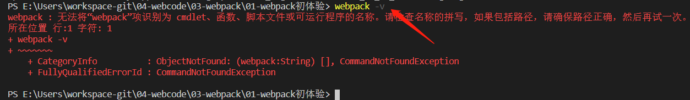
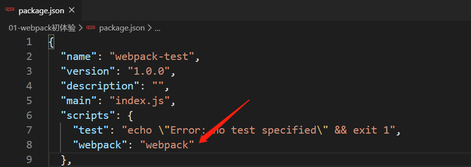
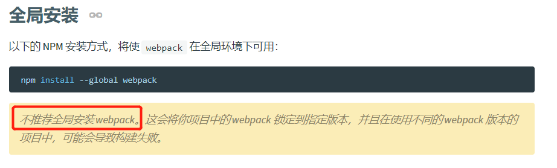

# webpack 笔记_v1.0.0

## 常见错误问题

### 1 无法将“webpack”项识别为 cmdlet、函数、脚本文件或可运行程序的名称……

问题截图：

分析问题：

系统：win10

npm 命令：`npm i webpack webpack-cli -D`，该命令为 webpack 本地安装命令。

查询webpack版本命令：`webpack -v` 出错

解决方法：

> 有3种方法，个人比较喜欢第一种。

**方法一**：找到你的项目根目录下的 package.json 文件，配置 **'scripts'** 这个选项，配置后面加上 `"webpack": webpack`。然后命令行输入命令 `npm run webpack` ，用 npm 来执行webpack相应命令即可，如 `npm run webpack -v` 。

**方法二**：在你的项目根目录中，有一个node_modules文件夹，这个文件夹下有.bin文件夹，将该路径添加到系统的环境变量PATH选项，命令行输入 `webpack -v` 正常显示版本信息。

    环境变量在：我的电脑 -> 属性 -> 高级设置 -> 环境变量 -> PATH

**方法三**：全局安装 webpack （官方建议不推荐）

